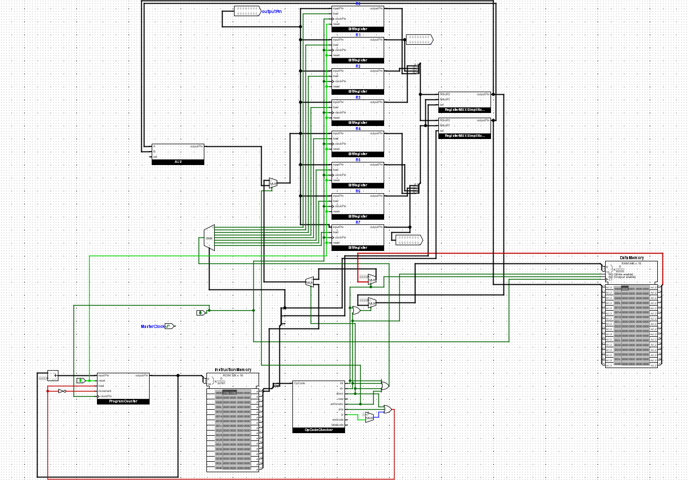

# BOLT-16 CPU

BOLT-16 is a simple CPU designed to run basic arithmetic operations and memory writing/reading using a custom assembly language.

## Try it!

You can try it out using the emulator at: [Emulator](https://reyanshs11.github.io/BOLT-16_CPU)
You can find example code in `Compiler/Assembly/main.rasm`

## Or Simulate it yourself!

You can simulate it locally following these steps:
1. Download Logisim-Evolution here: [Logisim Github Link](https://github.com/logisim-evolution/logisim-evolution)
2. Clone this repo
3. Write code in `Compiler/Assembly/main.rasm` and compile it using `compiler.cpp` and then `hexadecimal_converter.cpp`
4. Load `CPU.circ` into Logisim and load `compiled.hex` into InstructionMemory

I would recommend using the emulator, it is just as good if not better.
