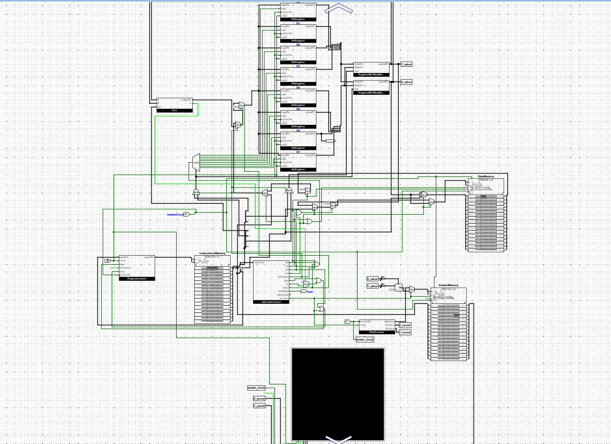

# BOLT-16 CPU

BOLT-16 is a simple 16-bit CPU designed to run basic arithmetic operations and memory writing/reading using a custom assembly language.

## Try it!

You can try it out using the emulator at: [Emulator](https://reyanshs11.github.io/BOLT-16_CPU)

You can find example code in `./Example Code`

### How to use the Emulator

The main emulator page is split into 3 main sections:
* Code area (left)
* Output area (right)
* Screen (appears below code area after writing to screen memory)

You can write code in the code area (or copy-paste it from the example code) and click `Run` to run the emulator. You will see your output on the right. The output is formatted ADDRESS: VALUE, with the left column have the binary representation and the right column having a decimal representation.

**NOTE:**
    **Make sure you always have `label $start` somewhere in your program. This is where code begins running. Always make sure you start your labels (both defining and calling) with `$`. Ex: `label $helloworld` or `jmp $helloworld`.**

## Or Simulate it yourself!

**IMPORTANT: I would recommend using the emulator, it is just as good if not better. Only use this option if you know what you're doing and want to see the CPU in action.**

You can simulate it locally following these steps:
1. Download Logisim-Evolution here: [Logisim Github Link](https://github.com/logisim-evolution/logisim-evolution)
2. Clone this repo
3. Write code in `Compiler/Assembly/main.rasm` and compile it using `Compiler/compiler.cpp` and then `hexadecimal_converter.cpp`
4. Load `CPU.circ` into Logisim and load `Compiler/Compiled/compiled.hex` into InstructionMemory

## CPU Specs

* 16 bit
* 8 CPU resident registers
* Read/Write memory
* 16 built-in ALU operations
* Screen write functionality

## How and Why I Built it

* Logsim-Evolution to design main circuit
* C++ to build compiler and emulator V1
* HTML/CSS/JS to build emulator V2 and website

I used Logisim-Evolution to build the main CPU circuit, but I realized that it's not the easiest to setup and run, especially if you don't have much knowledge about this kind of thing. Because of that, I ended up making an emulator website so that anyone can run it without downloading anything.